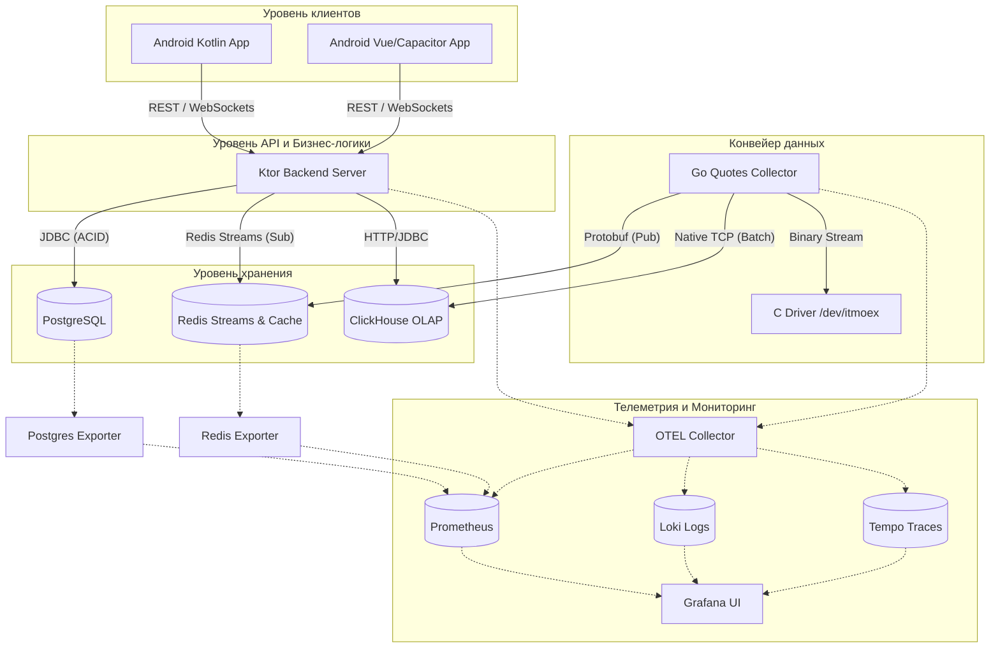
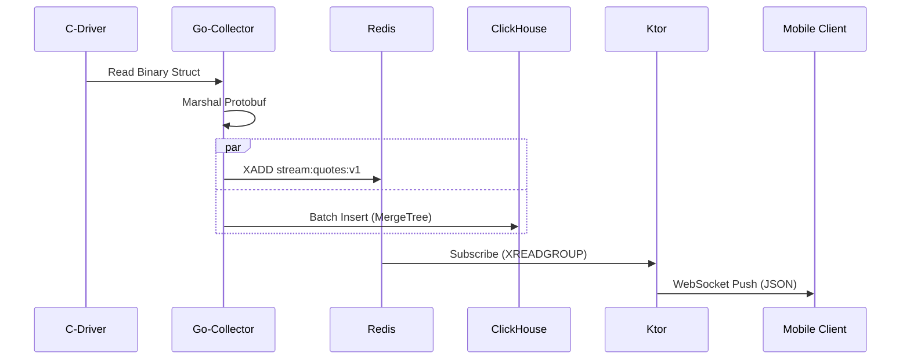
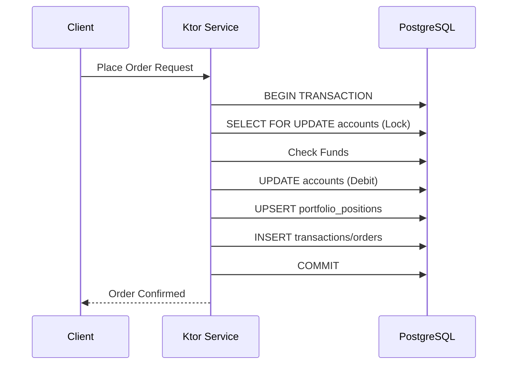

# Архитектурное описание системы Trading Exchange

Данный документ представляет собой формальное описание архитектуры торговой экосистемы Trading Exchange, разработанное в соответствии с требованиями технического задания (ТЗ) и спецификаций требований к ПО (SRS).

## 1. Введение и цели
Trading Exchange — это распределенная высоконагруженная система для имитации биржевой торговли, поддерживающая до 10 000 активных клиентов. 
**Цель архитектуры**: Обеспечение низкой задержки (low latency) при передаче котировок, транзакционной целостности при торговых операциях и глубокой наблюдаемости (observability) всей системы.

## 2. Общая архитектура (Container Diagram)

Система построена на принципах микросервисной архитектуры с четким разделением ответственности между конвейером данных (Data Pipeline) и бизнес-логикой (Business Logic).

---

## 3. Описание модулей и ответственности

### 3.1. Драйвер котировок (C Driver)
*   **Тимлид**: Nikita
*   **Роль**: Первоисточник данных (Mock-биржа).
*   **Реализация**: Драйвер Linux (блочное устройство sysfs). Использует шум Перлина для генерации реалистичных котировок.
*   **Контракт**: Бинарная структура `struct mock { char ticker[8]; float price; }`.

### 3.2. Сборщик котировок (Go Collector)
*   **Тимлид**: amsterdam121
*   **Роль**: Высокопроизводительный конвейер данных.
*   **Функции**:
    *   Чтение из `/dev/itmoex`.
    *   Сериализация в **Protobuf** (схема `quotes.v1.QuoteTick`).
    *   Публикация в Redis Streams для Real-time потребителей.
    *   Пакетная запись (Batching) в ClickHouse (до 10 000 записей или каждые 200 мс).

### 3.3. Бэкенд (Ktor Backend)
*   **Тимлид**: weebat
*   **Роль**: Центр управления транзакциями и API.
*   **Функции**:
    *   **Auth**: JWT-аутентификация и управление сессиями.
    *   **Trading**: Исполнение ордеров с использованием `BigDecimal` и блокировок `FOR UPDATE`.
    *   **Quotes**: Подписка на Redis Streams и трансляция в WebSockets.
*   **Слои**: Routing → Service → Repository → Database.

### 3.4. Телеметрия (OpenTelemetry Stack)
*   **Тимлид**: stella_stt
*   **Роль**: Обеспечение наблюдаемости (Three Pillars of Observability).
*   **Компоненты**:
    *   **Prometheus**: Метрики (RPS, Latency, балансы).
    *   **Loki**: Логи с привязкой к `traceId`.
    *   **Tempo**: Распределенные трейсы (путь запроса от Ktor до БД).
    *   **OTEL Collector**: Единая точка приема данных по протоколу OTLP.

---

## 4. Схема данных и взаимодействие

### 4.1. Транзакционная БД (PostgreSQL)
Используется для хранения критически важных данных.
- **Порядок блокировок**: `accounts` → `portfolio_positions` (защита от Deadlocks).
- **Уровень изоляции**: По умолчанию `READ COMMITTED`, для торговых операций — явные блокировки.

### 4.2. Аналитическая БД (ClickHouse)
- **Engine**: `MergeTree` для сырых данных, `AggregatingMergeTree` для свечей (OHLC).
- **Партиционирование**: По месяцам (`toYYYYMM(event_time)`).
- **Материализованные представления**: `quotes_ohlc_1m_mv` для автоматической агрегации тиков в минутные свечи.

### 4.3. Брокер сообщений (Redis Streams)
- **Стрим**: `stream:quotes:v1`.
- **Формат**: Protobuf.
- **Группы потребителей**: Позволяют Ktor-нодам масштабироваться при обработке потока.

---

## 5. Диаграммы процессов

### 5.1. Жизненный цикл котировки (Data Flow)

### 5.2. Исполнение ордера (Consistency)

---

## 6. Технический стек и Стандарты
*   **Языки**: Kotlin, Go, C, TypeScript.
*   **Сериализация**: Protobuf (для внутреннего стриминга), JSON (для внешнего API).
*   **Стандарты**: OpenAPI 3.0 (`swagger.yaml`), AsyncAPI (для WebSockets), Conventional Commits.
*   **Развертывание**: Docker Compose (интеграционный стек), Docker Multi-stage builds.

---
*Документ составлен на основе анализа srs, ТЗ и фактической реализации проекта.*
