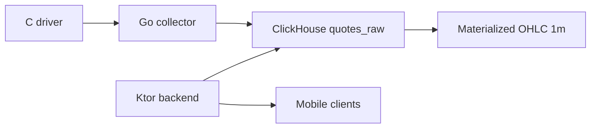

# ClickHouse Module

## Purpose

ClickHouse is the analytical storage layer for historical quote data. It is optimized for high-rate batch writes from the Go collector and low-latency range reads by Ktor for charts.

## Data Flow

## Owned Interfaces

- Go producer writes normalized quotes into `trading.quotes_raw`.
- Ktor consumer reads raw points, candles, summary, and latest historical price.
- Local operators use scripts in `clickhouse/scripts`.

## Reliability Notes

- ClickHouse is isolated in its own Docker Compose module and persistent volume.
- Host ports are bound to `127.0.0.1` for local development.
- Passwords are required through environment variables.
- Go batches writes and retries temporary insert failures with backoff.

